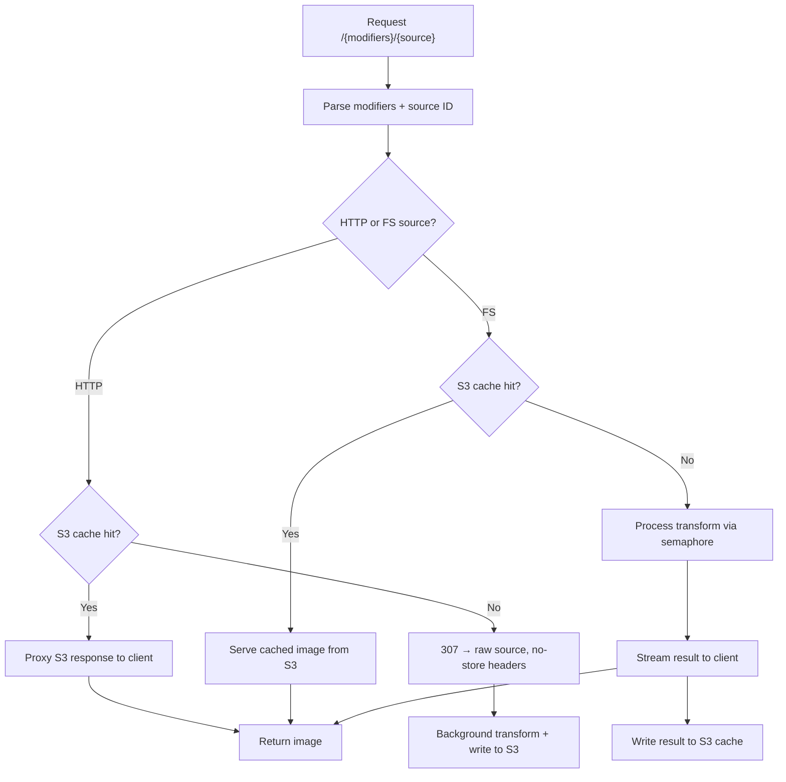

# ipx-server

An image transformation and optimization server built on [IPX](https://github.com/unjs/ipx), running on [Bun](https://bun.sh). Transformed images are cached in S3-compatible storage so repeat requests are served directly from cache without reprocessing.

## How it works

Requests arrive as `/{modifiers}/{source-url-or-path}`. The server parses the modifiers (resize, format, quality, etc.), fetches the source image, and returns the transformed result.

Two source types are handled differently:

**HTTP sources** — the first request redirects the client to the raw source immediately (zero latency), while the transform runs in the background. Subsequent requests are served from S3 cache.

**Filesystem sources** — the transform runs synchronously on first request and the result is streamed back. The output is written to S3 cache before returning.

In both cases, standard HTTP caching semantics apply: `ETag`, `Last-Modified`, `Cache-Control`, and `304 Not Modified` responses are all supported.



### Concurrency control

A semaphore limits simultaneous image transforms (`IPX_MAX_CONCURRENT`, default `3`). Identical concurrent requests for the same image+modifiers are deduplicated — only one transform runs, and all waiters share the result.

### Error recovery

If a transform fails, the server falls back to a `307` redirect to the raw source URL so the client always gets something.

## Configuration

Copy `.env.example` and fill in the values:

```sh
cp .env.example .env
```

| Variable | Default | Description |
|---|---|---|
| `IPX_HTTP_DOMAINS` | — | Comma-separated list of allowed HTTP source domains |
| `IPX_HTTP_MAX_AGE` | `0` | Cache-Control max-age for HTTP sources (seconds) |
| `IPX_FS_DIR` | `./public` | Root directory for filesystem sources |
| `IPX_FS_MAX_AGE` | `0` | Cache-Control max-age for filesystem sources (seconds) |
| `IPX_MAX_CONCURRENT` | `3` | Max simultaneous image transforms |
| `S3_ENDPOINT` | `https://s3.amazonaws.com` | S3-compatible endpoint |
| `S3_PORT` | `9000` | S3 port |
| `S3_USE_SSL` | `true` | Use TLS for S3 connection |
| `S3_ACCESS_KEY` | — | S3 access key |
| `S3_SECRET_KEY` | — | S3 secret key |
| `S3_BUCKET` | — | S3 bucket name (S3 caching is disabled if unset) |
| `CONSOLA_LEVEL` | `3` | Log verbosity (`0`=silent, `3`=info, `4`=debug) |

## Running

```sh
# Development (hot reload)
bun --watch src/index.ts

# Production
bun src/index.ts

# Build
bun build src/index.ts --outdir ./dist --target bun --sourcemap
```

## Docker

The compose file is designed for a [Traefik](https://traefik.io) + [Coolify](https://coolify.io) environment. It runs 3 replicas with a CPU limit of 1 core and 2 GB RAM each.

The server exposes a `/health` endpoint used by Traefik's healthcheck:

```sh
GET /health → { "status": "ok" }
```

## URL format

```
/{modifiers}/{source}

# Resize to 800×600, convert to webp
/w_800,h_600,f_webp/https://example.com/image.jpg

# Auto-format based on Accept header, no other transforms
/f_auto/https://example.com/image.png

# Filesystem source
/w_400/hero.jpg
```

Modifier separators: `,` `&`
Key/value separators: `:` `=` `_`
Use `_` as the modifiers segment to pass through with no transforms.

### Modifiers reference

#### Format & quality

| Modifier | Alias | Value | Example |
|---|---|---|---|
| `format` | `f` | `jpeg` `png` `webp` `avif` `tiff` `gif` `heif` — or `auto` (negotiated via `Accept` header) | `f_webp` |
| `quality` | `q` | Number (1–100) | `q_85` |
| `animated` | `a` | Flag (no value) | `animated` |

#### Resize

| Modifier | Alias | Value | Example |
|---|---|---|---|
| `width` | `w` | Pixels | `w_800` |
| `height` | `h` | Pixels | `h_600` |
| `resize` | `s` | `{width}x{height}` | `s_800x600` |
| `fit` | — | `contain` `cover` `fill` `inside` `outside` | `fit_cover` |
| `position` | `pos` | `center` `top` `bottom` `left` `right` `top-left` … or a Number | `pos_top` |
| `background` | `b` | Hex color (without `#`) | `b_ffffff` |
| `enlarge` | — | Flag — allow upscaling | `enlarge` |
| `kernel` | — | Sharp kernel name (`lanczos3` etc.) | `kernel_lanczos3` |

#### Crop & geometry

| Modifier | Alias | Value | Example |
|---|---|---|---|
| `crop` / `extract` | — | `{left}_{top}_{width}_{height}` | `crop_10_20_800_600` |
| `trim` | — | Threshold number | `trim_10` |
| `extend` | — | `{top}_{right}_{bottom}_{left}` | `extend_10_20_10_20` |
| `rotate` | — | Degrees | `rotate_90` |
| `flip` | — | Flag — vertical flip | `flip` |
| `flop` | — | Flag — horizontal flip | `flop` |

#### Filters & adjustments

| Modifier | Alias | Value | Example |
|---|---|---|---|
| `sharpen` | — | `{sigma}_{flat}_{jagged}` | `sharpen_1` |
| `blur` | — | Sigma (number) | `blur_5` |
| `median` | — | Size (number) | `median_3` |
| `flatten` | — | Flag — flatten alpha with background | `flatten` |
| `gamma` | — | `{gamma}_{gammaOut}` | `gamma_2.2` |
| `negate` | — | Flag — invert colors | `negate` |
| `normalize` | — | Flag — auto-level | `normalize` |
| `grayscale` | — | Flag | `grayscale` |
| `tint` | — | Hex color | `tint_ff0000` |
| `modulate` | — | `{brightness}_{saturation}_{hue}` | `modulate_1.2_1.5_90` |
| `threshold` | — | 0–255 | `threshold_128` |
